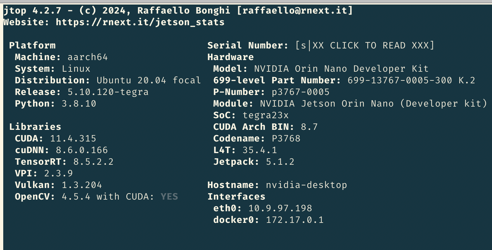
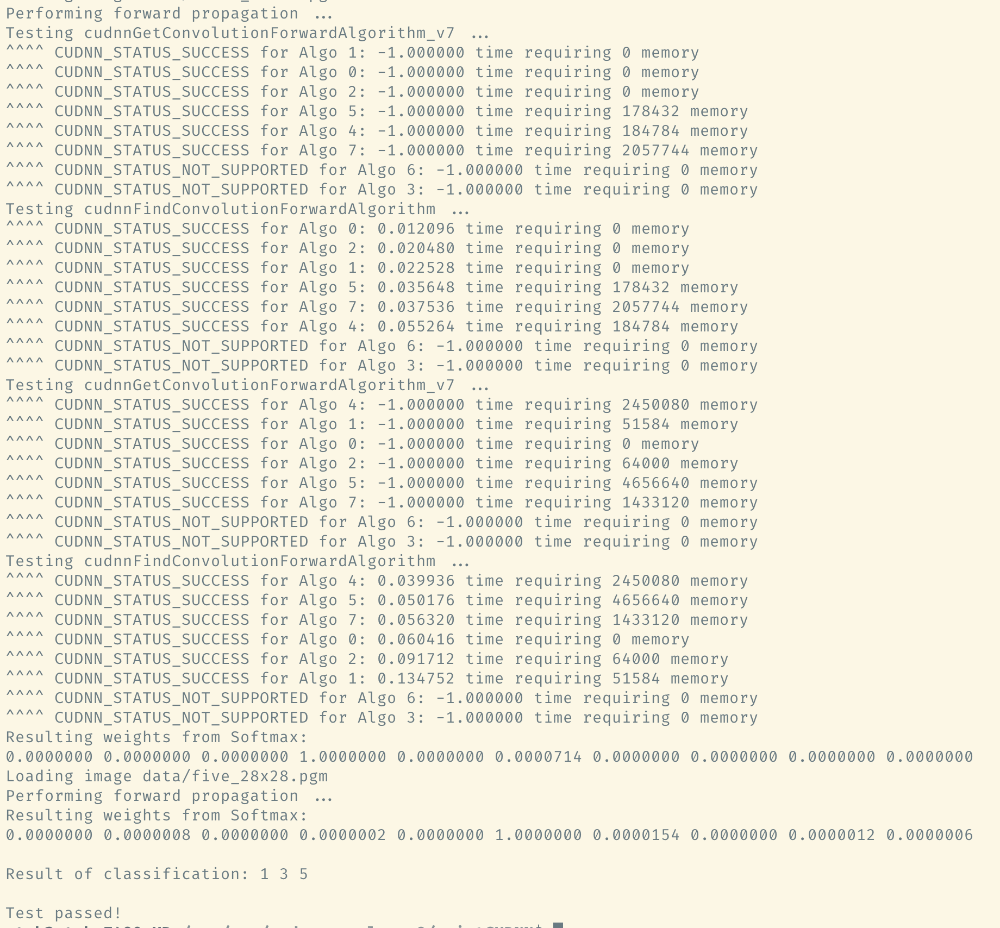
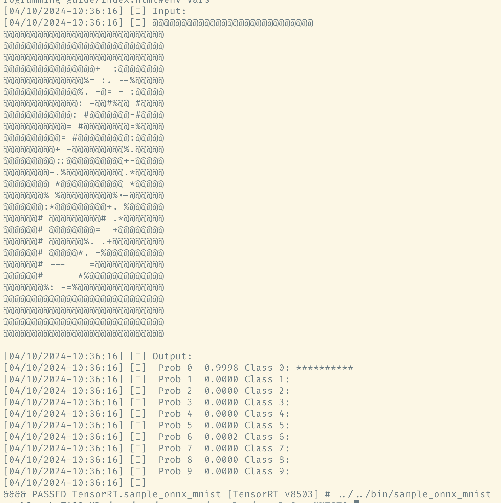
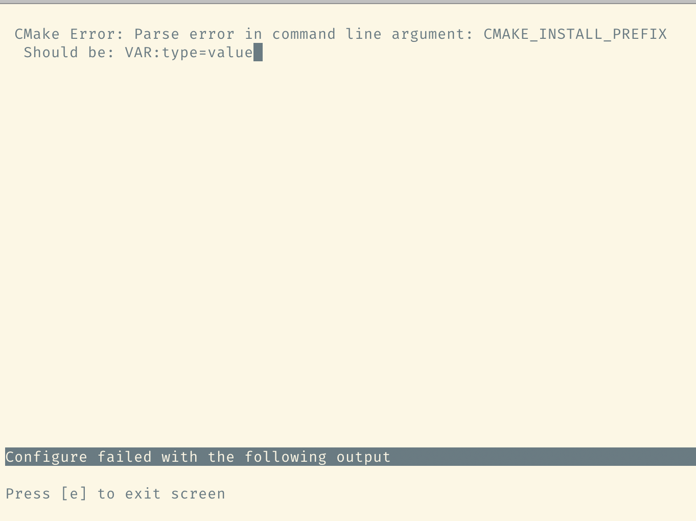
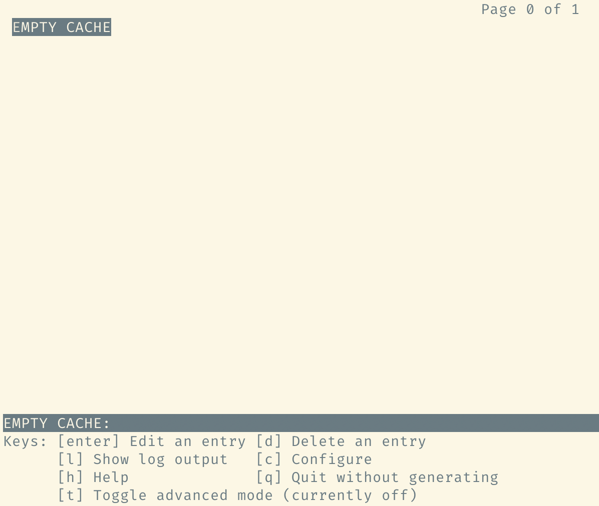
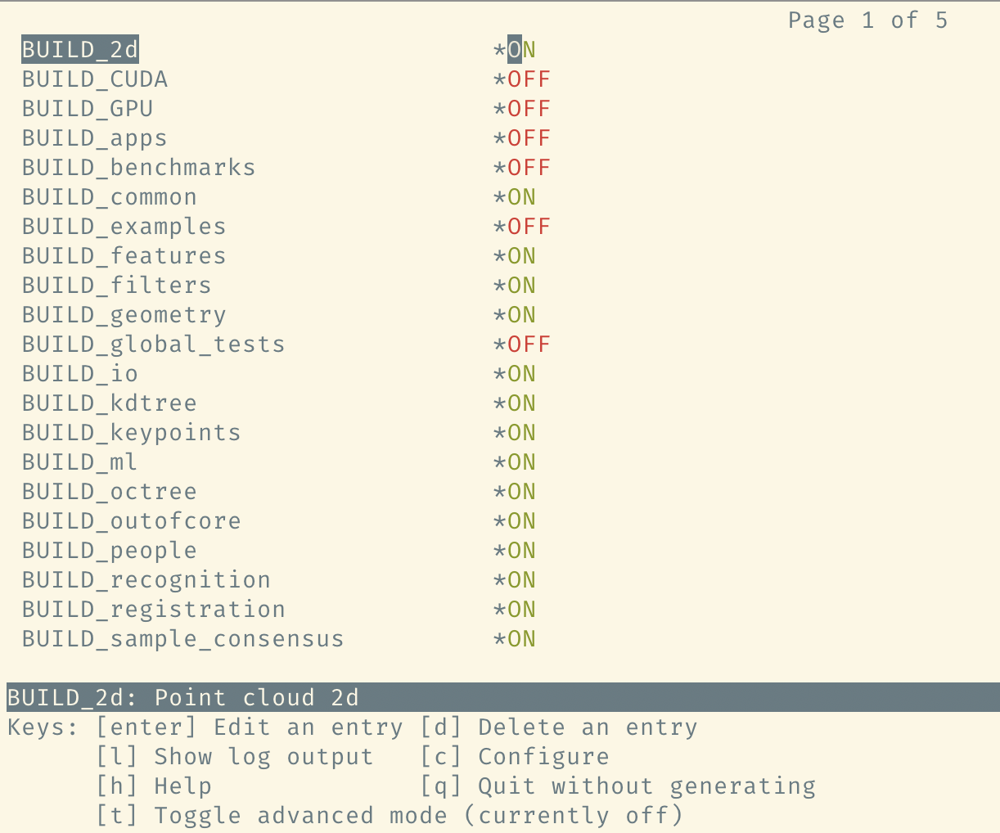
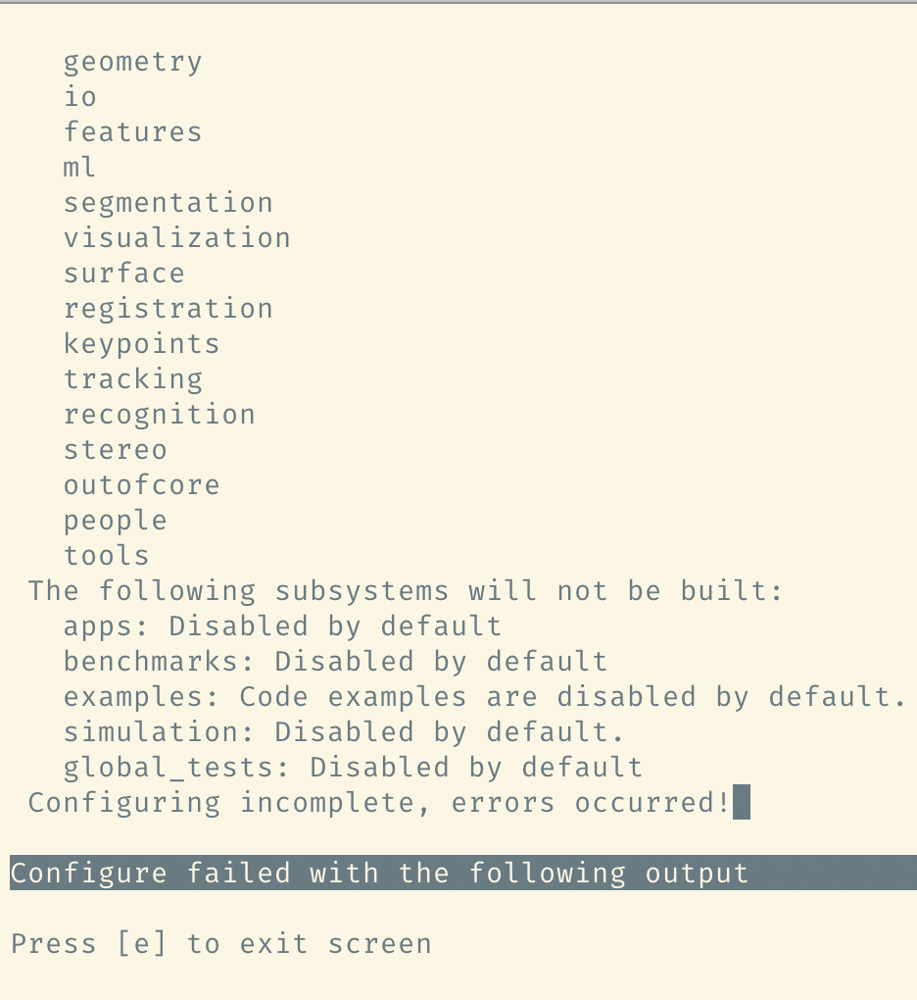

[中文](README_CN.md) | English

# point_cloud_detection_env

Tutorial for setting up ROS2/cuda/cudnn/tensorrt/opencv/pcl/caffe/onnxruntime/cpp/python environment, requires internet connection throughout the process.

Applicable to Nvidia Jetson, Ubuntu, WSL2 Ubuntu

> PS: If you find it useful, please give it a star

## Software Versions

I've placed each package (x86) on a net disk. For Jetson Orin Nano, you can directly use the compiled packages with "-compiled" suffix.

- [Baidu Netdisk (Code: BTR1)](https://pan.baidu.com/s/1oFAPBnrNXOSf30ojL528eQ?pwd=BTR1)

Additionally, you may need to check the computing power requirements for certain packages on [Nvidia's official device computing power](https://developer.nvidia.cn/cuda-gpus#compute).

Below are the details of each software:

- SystemOs: Ubuntu 20.04
- CUDA: 11.4
- cuDNN: 8.6.0
- TensorRT: 8.5.3
- OpenCV: 4.5.4
- OpenCV_Contrib: 4.5.4
- PCL: 1.13.0
- Caffe: 1.0
- ONNXRuntime: 1.16.3
- CMake: 3.26.4
- Python: 3.8
- GCC: 9.4.0
- ROS2: Foxy

---

## Change to a Domestic Source

[Guide to Tsinghua Ubuntu Mirror](https://mirror.tuna.tsinghua.edu.cn/help/ubuntu/)

Please note the differences in system version and architecture.

**x86_64**
```shell
# Backup
sudo cp /etc/apt/sources.list /etc/apt/sources.list.bak
echo '# Default commented out the source image to speed up apt update, if necessary, uncomment it by yourself
deb http://mirrors.tuna.tsinghua.edu.cn/ubuntu/ focal main restricted universe multiverse
# deb-src http://mirrors.tuna.tsinghua.edu.cn/ubuntu/ focal main restricted universe multiverse
deb http://mirrors.tuna.tsinghua.edu.cn/ubuntu/ focal-updates main restricted universe multiverse
# deb-src http://mirrors.tuna.tsinghua.edu.cn/ubuntu/ focal-updates main restricted universe multiverse
deb http://mirrors.tuna.tsinghua.edu.cn/ubuntu/ focal-backports main restricted universe multiverse
# deb-src http://mirrors.tuna.tsinghua.edu.cn/ubuntu/ focal-backports main restricted universe multiverse

deb http://security.ubuntu.com/ubuntu/ focal-security main restricted universe multiverse' > /etc/apt/sources.list
# Update and upgrade
sudo apt update && sudo apt upgrade
```

**arm64**
```shell
# Backup
sudo cp /etc/apt/sources.list /etc/apt/sources.list.bak
echo '# Default commented out the source image to speed up apt update, if necessary, uncomment it by yourself
deb http://mirrors.tuna.tsinghua.edu.cn/ubuntu-ports/ focal main restricted universe multiverse
# deb-src http://mirrors.tuna.tsinghua.edu.cn/ubuntu-ports/ focal main restricted universe multiverse
deb http://mirrors.tuna.tsinghua.edu.cn/ubuntu-ports/ focal-updates main restricted universe multiverse
# deb-src http://mirrors.tuna.tsinghua.edu.cn/ubuntu-ports/ focal-updates main restricted universe multiverse
deb http://mirrors.tuna.tsinghua.edu.cn/ubuntu-ports/ focal-backports main restricted universe multiverse
# deb-src http://mirrors.tuna.tsinghua.edu.cn/ubuntu-ports/ focal-backports main restricted universe multiverse

deb http://ports.ubuntu.com/ubuntu-ports/ focal-security main restricted universe multiverse
# deb-src http://ports.ubuntu.com/ubuntu-ports/ focal-security main restricted universe multiverse' > /etc/apt/sources.list
# Update and upgrade
sudo apt update && sudo apt upgrade
```

--- 

## Environment Variables

Set the following variables in *~/.bashrc*:

```shell
export LD_LIBRARY_PATH=$LD_LIBRARY_PATH:/usr/local/cuda/lib64:/usr/local/lib
export PATH=$PATH:/usr/local/cuda/bin
export CUDA_HOME=$CUDA_HOME:/usr/local/cuda
export CPLUS_INCLUDE_PATH=$CPLUS_INCLUDE_PATH:/usr/local/cuda/include
export PCL_ROOT=/usr/local/pcl-1.13.0
source /opt/ros/foxy/setup.bash
```

--- 

## CUDA, cuDNN, TensorRT

### Jetson

Nvidia provides a suite for Jetson development boards, which includes CUDA, cuDNN, TensorRT, etc.

```shell
# Install jtop
sudo -H pip3 install -U jetson-stats
sudo apt update
# CUDA, cuDNN, TensorRT, etc. will be installed automatically with Jetpack.
sudo apt install nvidia-jetpack
sudo reboot
```

After rebooting, input `jtop` and then press 7 to view as shown in the figure:



By default, OpenCV should show "With Cuda" as NO. However, it has been pre-compiled and installed, so it should show YES.

### Ubuntu

#### CUDA

For non-Nvidia development boards, we need to install CUDA manually. It's recommended to install CUDA, cuDNN, and TensorRT using the deb packages to avoid package not found errors.

**WSL2**
```shell
wget https://developer.download.nvidia.com/compute/cuda/repos/wsl-ubuntu/x86_64/cuda-wsl-ubuntu.pin
sudo mv cuda-wsl-ubuntu.pin /etc/apt/preferences.d/cuda-repository-pin-600
sudo dpkg -i cuda-repo-wsl-ubuntu-11-4-local_11.4.3-1_amd64.deb
sudo apt-key add /var/cuda-repo-wsl-ubuntu-11-4-local/7fa2af80.pub
```

**Normal**
```shell
wget https://developer.download.nvidia.com/compute/cuda/repos/ubuntu2004/x86_64/cuda-ubuntu2004.pin
sudo mv cuda-ubuntu2004.pin /etc/apt/preferences.d/cuda-repository-pin-600
sudo dpkg -i cuda-repo-ubuntu2004-11-4-local_11.4.3-470.82.01-1_amd64.deb
sudo apt-key add /var/cuda-repo-ubuntu2004-11-4-local/7fa2af80.pub
```

##### Compile and Install
```shell
sudo apt update
sudo apt install cuda
# Compile and test, can be skipped.
cd /usr/local/cuda/samples && make -j$(nproc)
```

WSL2 installation of CUDA requires additional configuration, otherwise, a warning will appear.

```shell
cd /usr/lib/wsl/lib
sudo ln -sf libcuda.so.1.1 libcuda.so.1
sudo ln -sf libcuda.so.1.1 libcuda.so
sudo ldconfig
```

#### cuDNN

```shell
sudo dpkg -i cudnn-local-repo-ubuntu2004-8.6.0.163_1.0-1_amd64.deb
sudo cp /var/cudnn-local-repo-ubuntu2004-8.6.0.163/cudnn-local-B0FE0A41-keyring.gpg /usr/share/keyrings/
sudo dpkg -i /var/cudnn-local-repo-ubuntu2004-8.6.0.163/libcudnn8_8.6.0.163-1+cuda11.8_amd64.deb
sudo dpkg -i /var/cudnn-local-repo-ubuntu2004-8.6.0.163/libcudnn8-dev_8.6.0.163-1+cuda11.8_amd64.deb
sudo dpkg -i /var/cudnn-local-repo-ubuntu2004-8.6.0.163/libcudnn8-samples_8.6.0.163-1+cuda11.8_amd64.deb
# Compile and test, can be skipped.
sudo apt install libfreeimage3 libfreeimage-dev
cd /usr/src/cudnn_samples_v8/mnistCUDNN
sudo make clean && sudo make -j$(nproc)
./mnistCUDNN
```



#### TensorRT

```shell
sudo dpkg -i nv-tensorrt-local-repo-ubuntu2004-8.5.3-cuda-11.8_1.0-1_amd64.deb
sudo cp /var/nv-tensorrt-local-repo-ubuntu2004-8.5.3-cuda-11.8/nv-tensorrt-local-3EFA7C6A-keyring.gpg /usr/share/keyrings/
sudo apt update
sudo apt install tensorrt
# Compile and test, can be skipped.
cd /usr/src/tensorrt/samples/sampleOnnxMNIST
sudo make clean && sudo make -j$(nproc)
../../bin/sample_onnx_mnist
```



---

## OpenCV

Reinstalling OpenCV is for CUDA acceleration. The OpenCV installed with Jetson Suite and Ubuntu apt does not include CUDA acceleration.

### Uninstall (Optional)

```shell
# Optional uninstall, some may not need
sudo apt purge libopencv*
sudo apt autoremove
sudo apt update
```

### Decompression

```shell
# Decompress
tar xvf opencv-4.5.4.tar.gz
unzip opencv_contrib-4.5.4.zip
```

### Configuration

After decompression, enter the build directory of opencv-4.5.4, there is a make.sh script, the content is as follows
**make.sh**
```shell
cmake -D CMAKE_BUILD_TYPE=RELEASE -D CMAKE_INSTALL_PREFIX=/usr/local \
-D BUILD_opencv_python2=0 -D BUILD_opencv_python3=1 -D WITH_FFMPEG=1 \
-D CUDA_TOOLKIT_ROOT_DIR=/usr/local/cuda \
-D WITH_TBB=ON -D ENABLE_FAST_MATH=1 -D CUDA_FAST_MATH=1 -D WITH_CUBLAS=1 \
-D WITH_CUDA=ON -D BUILD_opencv_cudacodec=OFF -D WITH_CUDNN=ON \
-D OPENCV_DNN_CUDA=ON \
# Modify according to device computing power
-D CUDA_ARCH_BIN=8.7 \
-D WITH_V4L=ON -D WITH_QT=OFF -D WITH_OPENGL=ON -D WITH_GSTREAMER=ON \
-D OPENCV_GENERATE_PKGCONFIG=ON -D OPENCV_PC_FILE_NAME=opencv.pc \
-D OPENCV_ENABLE_NONFREE=ON \
# Modify according to your python directory
-D OPENCV_PYTHON3_INSTALL_PATH=/usr/lib/python3.8/dist-packages \
# Modify according to the directory of opencv_contrib.zip
-D OPENCV_EXTRA_MODULES_PATH=/home/nvidia/opencv_contrib-4.5.4/modules \
-D INSTALL_PYTHON_EXAMPLES=OFF -D INSTALL_C_EXAMPLES=OFF -D BUILD_EXAMPLES=OFF .
```

### Install Dependencies

```shell
# First install the dependencies required by OpenCV
sudo apt install build-essential cmake pkg-config unzip yasm git checkinstall \
 libjpeg-dev libpng-dev libtiff-dev \
 libavcodec-dev libavformat-dev libswscale-dev libavresample-dev \
 libgstreamer1.0-dev libgstreamer-plugins-base1.0-dev \
 libxvidcore-dev x264 libx264-dev libfaac-dev libmp3lame-dev libtheora-dev \
 libfaac-dev libmp3lame-dev libvorbis-dev \
 libopencore-amrnb-dev libopencore-amrwb-dev \
 install libdc1394-22 libdc1394-22-dev libxine2-dev libv4l-dev v4l-utils \
 libgtk-3-dev \
 libtbb-dev
# Optional dependencies
sudo apt install libatlas-base-dev gfortran \
 libprotobuf-dev protobuf-compiler \
 libgoogle-glog-dev libgflags-dev \
 libgphoto2-dev libeigen3-dev libhdf5-dev doxygen 
```

### Compile and Install

```shell
# Compile and install
cd opencv-4.5.4/build
sh make.sh
make -j$(nproc)
sudo make install
```

---

## ONNXRuntime (Optional)

Choose either ONNXRuntime or Caffe for installation.

Enable CUDA cuDNN TensorRT support.

ONNXRuntime requires cmake >= 3.26.

### Install Dependencies

**cmake**
```shell
tar xvf cmake-3.26.4-linux-x86_64.tar.gz
sudo ln -sf /home/nvidia/cmake-3.26.4-linux-x86_64/bin/cmake /usr/bin/cmake
sudo ln -sf /home/nvidia/cmake-3.26.4-linux-x86_64/bin/ccmake /usr/bin/ccmake
```

### Compile and Install

**ONNXRuntime**
```shell
tar xvf onnxruntime-1.16.3.tar.gz
cd onnxruntime-1.16.3 
# Compile and install
sh make-arm64.sh
# According to system architecture
sh make-x86_64.sh
# After executing the script, dependencies will be downloaded from GitHub. The command may fail due to network issues. Repeatedly execute until the download completes and the compilation starts.
cd bulid/Linux/Release
sudo make install
```

---

## Caffe (Optional)

Choose either ONNXRuntime or Caffe for installation.

Enable CUDA cuDNN support.

> Caffe does not support cuDNN8 by default. I have modified the Caffe source files, which you can directly use.

### Install Dependencies
```shell
# Install dependencies required by Caffe
sudo apt install libprotobuf-dev libleveldb-dev libsnappy-dev libopencv-dev libhdf5-serial-dev protobuf-compiler \
libboost-all-dev libopenblas-dev liblapack-dev libatlas-base-dev \
libgflags-dev libgoogle-glog-dev liblmdb-dev \
git cmake build-essential 
```

### Decompression
```shell
tar xvf caffe-1.0.tar.gz
cd caffe-1.0 
```

### Configuration

After decompression, enter the root directory of caffe-1.0. There is a Makefile.config file, where some parameters need to be adjusted according to the actual situation.

```shell
# Line 73, modify according to your actual directory
PYTHON_INCLUDE := /usr/include/python3.8 \
                   /usr/lib/python3/dist-packages/numpy/core/include
# Lines 89, 90, choose according to the system architecture
LIBRARY_DIRS := $(PYTHON_LIB) /usr/local/lib /usr/lib /usr/lib/x86_64-linux-gnu /usr/lib/x86_64-linux-gnu/hdf5/serial
LIBRARY_DIRS := $(PYTHON_LIB) /usr/local/lib /usr/lib /usr/lib/aarch64-linux-gnu /usr/lib/aarch64-linux-gnu/hdf5/serial
```

### Compile and Install
```shell
make all -j$(nproc)
make distribute
```

---

## Ros2Foxy

This should be the simplest. You can use a domestic source to accelerate installation.

```shell
sudo sh -c 'echo "deb http://mirrors.ustc.edu.cn/ros2/ubuntu $(lsb_release -sc) main" > /etc/apt/sources.list.d/ros-latest.list'
sudo apt-key adv --keyserver 'hkp://keyserver.ubuntu.com:80' --recv-key C1CF6E31E6BADE8868B172B4F42ED6FBAB17C654
sudo apt update
# Full set
sudo apt install ros-foxy-desktop python3-argcomplete
# Base package, without GUI and related demos
sudo apt install ros-foxy-ros-base python3-argcomplete
# ROS2 development tools, ex:colcon
sudo apt install ros-dev-tools
sudo apt install ros-foxy-pcl-conversions
sudo apt install ros-foxy-cv-bridge
# rosbridge
sudo apt install ros-foxy-rosbridge-suite
```

---

## PCL

Reinstalling PCL is similar to OpenCV, enabling CUDA support.

### Configuration

```shell
tar xvf pcl-1.13.0.tar.gz
mkdir -p pcl-1.13.0/build && cd pcl-1.13.0/build
ccmake -DCMAKE_BUILD_TYPE=Release -DCMAKE_INSTALL_PREFIX=/usr/local/pcl-1.13.0 ..
```

Afterwards, configure as shown in the images below:

  
  
  


### Compilation and Installation

```shell
cmake .
make -j$(nproc)
sudo make install
```

---

## Summary

If this tutorial is helpful to you, please don't forget to star it. Thank you very much.

---

## License

[Apache 2.0](LICENSE)
